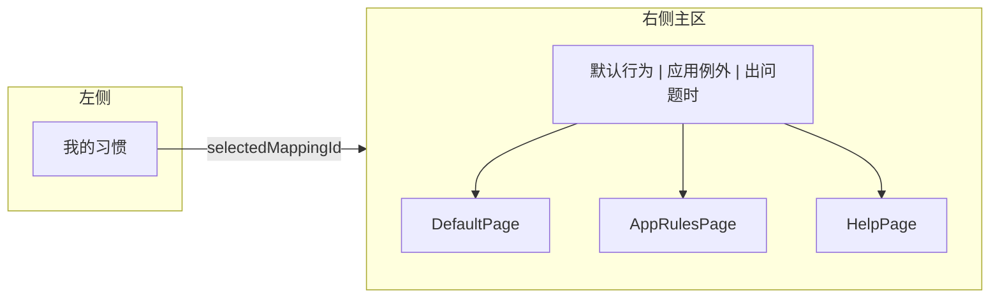

# 习惯设置 IA 改版建议

这版目标不是“做更多”，而是“让新手更容易看懂”。

核心原则：

1. 只保留一个主概念：`习惯`
2. 少用抽象词，少用后台术语
3. 把高频操作放前面，把排错内容收起来
4. 同一件事只出现一次，不重复放入口

---

## 1. 推荐的信息架构

### 对应关系

- `默认行为`：当前习惯最基础的按键流程
- `应用例外`：只给某些应用单独改规则
- `出问题时`：兼容性、冲突、少数异常情况

---

## 2. 命名建议

### 主概念

- `scheme / profile / 方案` 统一收敛成 `习惯`

### 页面命名

- `全局方案` -> `默认行为`
- `应用程序方案` -> `应用例外`
- `高级设置` -> `出问题时`

### 按钮文案

- `新建方案` -> `新增习惯`
- `方案管理` -> `切换习惯`
- `方案已生效` -> `习惯已生效`

### 说明文案

- `管理当前习惯的默认规则、应用规则与兼容性`
  -> `管理当前习惯的按键、应用例外和兼容性`

---

## 3. 更适合新手的布局

### 3.1 左侧只做“选谁”

左侧只保留：

- 习惯列表
- `+ 新增习惯`

不要在左侧再放一套和主区重复的“管理入口”。

### 3.2 右侧只做“怎么用”

右侧按任务分三块：

1. 默认行为
2. 应用例外
3. 出问题时

这样用户先学“怎么用”，再去看“哪里能改细节”。

---

## 4. 默认行为页建议

当前这页最重要的是让用户立刻理解流程，所以建议用“三步卡片”而不是表格。

### 三步

1. `你按的键`
2. `帮你打开语音`
3. `说完后怎么收尾`

### 新手友好点

- 每步只放一个主操作
- 每步都显示当前值
- 第三步默认折叠，避免一上来就太复杂
- 点击某一步时，只把这一块高亮出来

### 不建议

- 用表格做主编辑区
- 同时在多个地方编辑同一件事
- 把“启动键 / 语音快捷键 / 收尾方式 / 中止键”全塞到一张密集表里

---

## 5. 应用例外页建议

这一页的目标不是讲清所有技术细节，而是回答：

> “某个应用有特殊情况吗？”

### 推荐结构

每个应用一张卡，卡里只放三类信息：

- 发送方式
- 这个应用要不要单独用快捷键
- 是否设为主要应用

### 文案建议

- `应用行为` + `应用工作流`
  -> 合并成 `应用例外`

### 好处

- 用户不会被两个卡片来回打断
- 不用理解“行为”和“工作流”是不是两件事
- 入口更像“针对某个应用单独改一下”

---

## 6. 出问题时页建议

这页不要常驻展示太多内容，只展示“确实需要处理”的东西。

### 只在需要时出现

- 有冲突时显示冲突提示
- 开了确认发送时显示相关设置
- 选了可能不兼容的输入法时显示提示

### 空状态

如果什么问题都没有，就直接显示：

> 当前没有需要调整的兼容性设置

### 好处

- 新手不会被“高级设置”吓到
- 用户只有在遇到问题时才会去看这页

---

## 7. 我更推荐的最终命名

### 方案 A: 最适合新手

- `默认行为`
- `应用例外`
- `出问题时`

### 方案 B: 更平衡

- `默认规则`
- `应用规则`
- `兼容性`

### 不太建议

- `全局方案 / 应用程序方案 / 高级设置`

原因很简单：

- 太像工程后台
- 术语跨度大
- 用户一眼看不出自己该点哪一个

---

## 8. 实施顺序建议

1. 先统一文案，把 `方案` 收敛成 `习惯`
2. 再改默认行为页为三步卡片
3. 再合并应用例外页
4. 最后把出问题时的内容做成按需展示

---

## 9. 一句话总结

这次改版最重要的不是“拆得更细”，而是“让用户不用学习太多新词”。

如果面向小白，我建议优先用：

- `默认行为`
- `应用例外`
- `出问题时`

这套名字比“默认规则 / 应用规则 / 兼容性设置”更像人话，也更容易被第一次接触的人理解。
