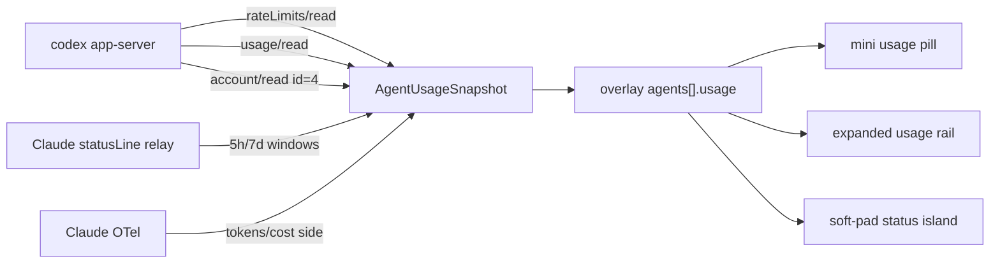

# Soft Pad Usage Display v1

Phase B 已经把硬数据存进 `AgentUsageSnapshot`。v1 是复用现有 overlay state + 三块展示面，不是新的用量架构。外部 CLI adapters 留 phase 2，且不得覆盖 app-server 字段。

## Verdict

- 无新 IPC：复用已注册的 `cmd_codex_micro_overlay_get_state`
- Codex 权威源：app-server；外部 CLI（phase 2）只填空字段
- Scope：adapter enrichment 不做；mini 单 pill + Soft Pad status 两行 meta；无 PitStop provider/account cards

## Locked decisions

### 1. Backend：`account/read` 与 settle 语义

在 `src-tauri/src/agent_usage.rs` 的 `refresh_codex_account_once`：

- 发出 `account/rateLimits/read` (id 2)、`account/usage/read` (id 3)、`account/read` (id 4, `refreshToken: false`)
- **禁止**「rate + usage 到齐就立即退出」。响应顺序不保证。
- 分别记录 settled（成功或 error 都算 settled）：
  - `rate_settled`
  - `usage_settled`
  - `account_settled`
- **三者都 settled 才退出**；rate+usage 已 settled 后，给 account 额外 **2–3s** 等待上限（当前 `ACCOUNT_EXTRA_WAIT = 2500ms`）。account 超时 → 标记 account settled，**不影响** rate/usage 成功，**不把** usage 状态降为 error。
- `AgentUsageSnapshot` 字段：`accountType`、`accountLabel`（后端脱敏）、`planType`
- Plan 优先级：`account.planType`；缺失时回退 rate-limit 响应的 `planType`
- API Key 模式：`account_type = api_key`，UI 显示 `API Key`；**不伪造套餐**（不继承 rate planType）
- 完整邮箱不进 snapshot、日志或 tooltip；只输出脱敏值（local 首字符 + `***` + `@` + domain；非法 → 空）
- **account 成功 ≠ usage ready**：只有窗口/token 数据决定 usage status。仅 account 返回时保存身份，usage 仍为 `unavailable`/`stale`。rate/usage 刷新失败时保留上次账号和套餐。
- `source` 保持 `codex_app_server`

### 2. Soft Pad status island：保留「恢复点」，加第二行

**不要替换「恢复点」**。Time Machine 已展示「未保护 / 已保护 / 自动 · 15m」，不是占位符。

同一 status bar 两行（现有 `flex-wrap` 已支持，无新卡片）：

```
状态灯 · Codex    键位 · 18个    恢复点 · 自动15m
账号 · m***@example.com · Plus
额度 · 5h余63% / 7d余41%    重置 · 2h12m
```

- 文件：`soft-pad-status-island.tsx`、`soft-pad-hub-ui.js`
- Props：`account`、`plan`、`usageSummary`、`resetCountdown`、`usageState`；**保留** `restorePoint`
- 轮询（单例 + 页面门控）：
  - 打开页面立即读一次
  - scope 切换：复用缓存并立即刷新
  - **全局只一个** 30s `setInterval`（`ensureOverlayUsagePolling`）
  - 仅当 `drawerOpen && settingsPanel === 'softPad'`（及等价 DOM 可见）时调用 IPC
  - 页面隐藏 / `onPanelLeave` → `stopOverlayUsagePolling`，不请求

### 3. Mini bar：独立 pill + renderable-first picker

文件：`codex-micro-overlay.html`、`codex-micro-overlay.css`、`codex_micro_overlay.rs`

- `OVERLAY_WIDTH_MINI` ≈ 240
- **独立** `applyMiniUsagePill` / `pickMiniUsageKind`；**禁止**把 `appAgent` 逻辑塞进 `applyMiniAgentChips`（测试护栏：chips 不读 singleton `appAgent`/`appStatus`）
- Pill CSS 必须：`min-width: 0; overflow: hidden; text-overflow: ellipsis; white-space: nowrap;`
- Picker 顺序（每步都要有 **renderable usage**）：
  1. current `appAgent` 且 renderable
  2. `needs_input` / `running` 且 renderable
  3. Codex ready/renderable
  4. 首个其他 renderable provider
  5. 隐藏 pill（不要显示 `--` 挤掉有效 Codex 额度）
- Cursor：无官方 quota → **永不占 pill**

### 4. 展示合同

| 面 | 文案 | 规则 |
|---|---|---|
| mini Codex | `C 63% · 2h12m` | primary 窗口 % + primary `resetsAt`；无 primary 才用第一个有效窗口 |
| mini Claude | `Cl 76% · 3h12m` | Claude Code **statusLine** 的 5h/7d 窗口；无窗口时隐藏（OTel session/$ 仍不展示） |
| mini Cursor | （隐藏） | 无可用 quota 不占 pill |
| expanded rail | `5h余63% · 2h12m重置` / `7d余41% · …` | **每个窗口各自** reset；禁止 5h/7d 共用一个倒计时 |
| Soft Pad 设置 | 见上两行 layout | `resetCountdown` 取 primary；无 primary → 首个有效窗口 |
| tooltip | 双窗口 + source + 上次刷新 | 仅脱敏账号 |

`formatResetCountdown(resetsAt)`：

- `< 1e12` → 秒；`>= 1e12` → 毫秒
- 到分钟：`2h12m`、`3d4h`
- 过去 / 零 / null / NaN → `待刷新` 或空（UI 槽位用 `—`）；永不负数

### 5. Data flow



Claude 用量双通道：`ClaudeStatusLineState`（额度窗口）与 `ClaudeOtelState`（token/费用）独立 `observed_at`，经 `compose_claude_snapshot` 合成；OTel 不得刷新窗口新鲜度。statusLine 超时：≤15m ready → ≤6h stale → 之后丢弃窗口。

## Explicitly out of v1

- PitStop provider/account cards、多账号切换
- 外部 CLI adapters（`codex-rate` / `codexbar` / `claude-monitor`）— phase 2 merge-only；**Claude 5h/7d 已由 statusLine 官方通道覆盖**
- 新 IPC、burn-rate 预测、Cursor quota
- 后端 countdown timer（overlay 已 ~1.5s 刷新）
- statusLine 包装用户自定义 command；转发 `context_window` / statusLine `cost`

## Phase 2（现在不实现）

PATH probe + 超时 + max stdout + 严格 JSON；只合并空字段；Codex 外部 CLI；Claude session/$ 仍仅 OTel；缺工具静默 skip。

## UI 文案合同（数据源）

| UI 文案 | 数据源 | 含义 |
|---|---|---|
| `Nh余 N%` / `Nd余 N%` | `account/rateLimits/read` | 限额窗口剩余，不是账户余额 |
| `Nh余 N% · Xm重置` | 同上 + 前端 `resetsAt` | 窗口剩余 + 该窗口重置倒计时 |
| 脱敏账号 / 套餐 | `account/read` → `accountLabel` / `planType` | 后端脱敏；plan 优先 account |
| `累计 N` | `account/usage/read` | lifetime token summary |
| `会话 N` | `thread/tokenUsage/updated` | 仅 OneTone 管理的 thread |
| `本会话 N` / `子任务 N` / `估算 $N` | Claude OTel | **不在 mini/Soft Pad 额度行展示**（本地估算，非正式账单） |
| `Nh余 N%`（Claude） | Claude Code statusLine → `/api/claude-statusline` | 官方 5h/7d 限额窗口 |
| `DeepSeek 余额 ¥N` / `$N` | Claude `ANTHROPIC_BASE_URL=api.deepseek.com` → `GET /user/balance` | API 现金余额（无 % 窗口；不接 cookie 日用量） |
| `Ark/GLM/MiniMax Nh余N%` | `provider_usage`：arkcli / quota/limit / remains | Coding Plan 窗口；见 `docs` 多厂商方案 |
| `Kimi 余额` | Moonshot `GET /v1/users/me/balance` | 余额文案；细分消耗看本机账本 |
| 百炼 / MiMo | `manual_or_local_estimate` | 本机消耗 + 控制台入口，不伪造官方剩余 |
| Cursor `用量 --` | 无官方接口 | 产品边界 |
| Claude `用量 --` | 无官方额度窗口 | 与 Cursor 同边界；后端仍可 ingest OTel |

## Tests（合同）

### Rust（`agent_usage.rs`）

- ChatGPT email + plan
- email 脱敏
- API Key account（无假套餐）
- account plan 缺失 → rate-limit fallback
- account 超时但 rate/usage 成功 → usage 仍 ready
- account-only → 不把 usage 标成 ready

### JS

- `formatResetCountdown` **必须真正执行函数**（不是只断言源码含函数名）：秒时间戳、毫秒时间戳、过去时间、0/null/NaN、跨天格式、primary 缺失 fallback
- 共享实现：`src/js/features/agent/usage-format.js`（overlay + Soft Pad hub + node tests）
- mini：`applyMiniUsagePill` 独立于 chips；picker renderable-first；Cursor 不占 pill
- Soft Pad：单例 30s timer + 页面门控字符串/行为护栏

## 新手排错

- Codex「未连接」：终端 `codex --version`；ChatGPT/受支持身份登录；API-key-only 不提供 account usage。Windows PATH 缺 CLI 时设 `ONETONE_CODEX_BIN`。
- Claude「未连接」：确认 loopback `:8796`、OTel env、`claude --debug`。
- Cursor `--`：产品边界，不是安装故障。
- 文案只写「窗口余」，不要改成「账户余额」。
- 关闭轮询：`ONETONE_AGENT_USAGE=0`。
